# Smart Mailbox - Architecture Diagram

## System Overview

```mermaid
graph TB
    subgraph "Client Layer"
        Browser["🌐 Web Browser"]
    end

    subgraph "Frontend (React)"
        WebApp["📱 React Web App<br/>Port 3000"]
        AuthProvider["🔐 AuthProvider"]
        Dashboard["📊 Dashboard"]
        Inbox["📥 Inbox"]
        Mailboxes["📬 Mailbox Manager"]
    end

    subgraph "API Gateway"
        Nginx["🔀 Nginx<br/>Port 80"]
    end

    subgraph "Backend (FastAPI)"
        API["⚡ FastAPI Server<br/>Port 8000"]
        AuthRoutes["🔑 Auth Routes"]
        EmailRoutes["📧 Email Routes"]
        MailboxRoutes["📮 Mailbox Routes"]
        GmailService["📨 Gmail Service"]
    end

    subgraph "Background Workers"
        Worker["⚙️ Celery Workers"]
        EmailSync["🔄 Email Sync"]
        AIProcessor["🤖 AI Processor"]
    end

    subgraph "Data Layer"
        PostgreSQL["🐘 PostgreSQL<br/>Port 5432"]
        Redis["🔴 Redis<br/>Port 6379"]
    end

    subgraph "External Services"
        GoogleOAuth["🔒 Google OAuth"]
        GmailAPI["📬 Gmail API"]
        LLM["🧠 LLM API"]
    end

    Browser --> WebApp
    WebApp --> Nginx
    Nginx --> API
    
    WebApp --> AuthProvider
    AuthProvider --> Dashboard
    AuthProvider --> Inbox
    AuthProvider --> Mailboxes
    
    API --> AuthRoutes
    API --> EmailRoutes
    API --> MailboxRoutes
    API --> GmailService
    
    AuthRoutes --> GoogleOAuth
    GmailService --> GmailAPI
    
    API --> PostgreSQL
    API --> Redis
    Worker --> Redis
    Worker --> PostgreSQL
    
    Worker --> EmailSync
    Worker --> AIProcessor
    AIProcessor --> LLM
```

---

## Component Details

### Frontend (React + TypeScript)
| Component | Description |
|-----------|-------------|
| `AuthProvider` | Manages user authentication state and Google OAuth |
| `Dashboard` | Main dashboard with email statistics |
| `InboxList` | Email inbox with search, filter, and bulk actions |
| `MailboxForm` | Connect external mailboxes via IMAP/SMTP |
| `Layout` | App shell with navigation and theme toggle |

### Backend (FastAPI + Python)
| Route | Endpoint | Description |
|-------|----------|-------------|
| Auth | `/auth/google/oauth` | Google OAuth login with Gmail scopes |
| Emails | `/emails` | Email CRUD operations |
| Mailboxes | `/mailboxes` | Mailbox connection management |
| Gmail | `/gmail/inbox` | Direct Gmail API access |
| Jobs | `/jobs` | Background job monitoring |

### Data Models

---

## Technology Stack

| Layer | Technology |
|-------|------------|
| **Frontend** | React 18, TypeScript, Material UI, React Router |
| **Backend** | FastAPI, SQLAlchemy, Pydantic |
| **Database** | PostgreSQL 15 |
| **Cache/Queue** | Redis |
| **Workers** | Celery |
| **Auth** | Google OAuth 2.0, JWT |
| **Email** | Gmail API, IMAP/SMTP |
| **AI** | LLM Integration for drafts |
| **Container** | Docker, Docker Compose |
| **Proxy** | Nginx |

---

## Authentication Flow

---

## Deployment Architecture

---

*Developed by [ThinkHive Labs](https://www.thinkhivelabs.com)*
